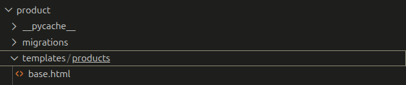
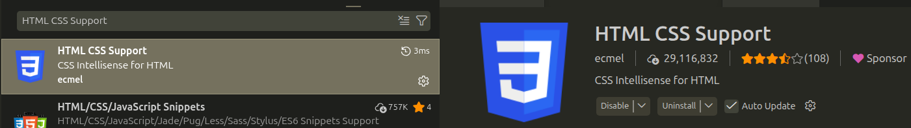
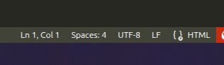

Для квалицификационного экзамена в Сириусе с Django
## Для начала создайте виртуальное окружение:

``` python
python3 -m venv venv
```

После этого активируйте:

```bash 
source /venv/bin/activate
```

Затем установите библиотеки, файл библиотек находится [здесь](https://github.com/SvyatAgainst/ExamDjango/blob/main/requirements.txt).
Команда для установки библиотек:

``` python
pip install -r requirements.txt
```
## Затем создайте проект django:

``` python
django-admin startproject --имя вашего проекта-- .
```

(Точка, чтобы создать в текущей директории, но необязательно), если без точки, то перейдите в директорию, где лежит manage.py
## После этого создайте приложение:

``` python
python manage.py startapp --имя вашего приложения--
```

Далее нужно добавить приложение в setting.py проекта:  ['--имя приложения--'](https://github.com/SvyatAgainst/ExamDjango/blob/main/exam/settings.py#43)

## После этого создаём модель с валидацией (таблицу): примеры таких моделей лежат в [models.py приложении](https://github.com/SvyatAgainst/ExamDjango/blob/main/product/models.py)

> P.S. Валидацию проводить желательно со всеми типами полей в модели. Но после валидации очень важно писать эти строки:

``` python
def save(self, *args, **kwargs):
	self.full_clean()
	super().save(*args, **kwargs)

```

Если модель написана, то нужно применить миграцию:

``` python
python manage.py makemigrations

python manage.py showmigrations #Чтобы увидеть миграции

python manage.py migrate
```

## Создаём админ-панель

После создания и мигрирования моделей, нужно создать админку этой модели, как можно догадаться, [пример находится здесь](https://github.com/SvyatAgainst/ExamDjango/blob/main/product/admin.py)

Дальше, чтобы протестировать модель и её валидацию, нужно создать пользователя для admin-панели:

```python
python manage.py createsuperuser
```

> При создании пользователя будет предложен автоматический вариант имени пользователя. После выбора имени, нужен пароль и почта (можно выдумать)

## Для теста можно запустить сервер командой:

``` python
python manage.py runserver

python manage.py runserver 8000 ### Если не работает первый вариант, попробуйте указать конкретный порт
```

## Далее, настройте окружение

Для настройки окружения создайте новый файл [.env](https://github.com/SvyatAgainst/ExamDjango/blob/main/.env). <- Тут пример, но по факту вы можете добавить больше данных, чтобы защитить их. Затем в settings измените получение данных, которые лежат в env:

``` python
from dotenv import load_dotenv
import os

load_dotenv()

SECRET_KEY = os.getenv('SECRET_KEY')
DEBUG = os.getenv('DEBUG', 'False') == 'True'

# PORT = os.getenv('PORT', 8000) # Если хочется побольше данных в окружении)
```

Если не установили dotenv:

``` python
pip install dotenv
```

> Для выполнения окружения ещё важно выключить DEBUG, но желательно делать это в конце работы. Но тогда для этого нужно в ALLOWED_HOSTS указать все принимаемые подключения, иначе debug с false будет с ошибкой:
``` python
ALLOWED_HOSTS = ['*'] 
```
> ЕСЛИ ВЫ ВЫКЛЮЧАЕТЕ DEBUG, УДОСТОВЕРЬТЕСЬ, ЧТО У ВАС СОБРАНА СТАТИКА.
## Добавляем метрики

Чтобы добавить метрики, нужно создать [файл метриков в приложении](https://github.com/SvyatAgainst/ExamDjango/blob/main/product/middleware.py). Файл метриков лежит в примере, но важно учитывать базовую структуру метрики:
``` python
class MetricMiddleware:
	def __init__(self, response):
		self.get_response = response
		...
	def __call__(self, request):
		response = self.get_response(request)
		status_code = response.status_code
		...
		return response
```

Метрики потом обязательно добавить в список [middleware проекта](https://github.com/SvyatAgainst/ExamDjango/blob/main/exam/settings.py#55):
``` python
MIDDLEWARE = [
    'django.middleware.security.SecurityMiddleware',
    'whitenoise.middleware.WhiteNoiseMiddleware',
    'django.contrib.sessions.middleware.SessionMiddleware',
    'django.middleware.common.CommonMiddleware',
    'django.middleware.csrf.CsrfViewMiddleware',
    'django.contrib.auth.middleware.AuthenticationMiddleware',
    'django.contrib.messages.middleware.MessageMiddleware',
    'django.middleware.clickjacking.XFrameOptionsMiddleware',
    'product.middleware.MetricMiddleware' # Название вашего файла и класса метрик
]
```

## После этого, собираем статику

Для сбора статики на экзамене был предложен простой способ с помощью библиотеки whitenoise, если не установили:

``` python
pip install whitenoise
```

Затем, добавляем whitenoise в [список middleware проекта](https://github.com/SvyatAgainst/ExamDjango/blob/main/exam/settings.py#46-56), чтобы позволить ему грузить статику:

``` python
MIDDLEWARE = [
    'django.middleware.security.SecurityMiddleware',
    
    'whitenoise.middleware.WhiteNoiseMiddleware', #<- ОН НАХОДИТСЯ ЗДЕСЬ!!!!4
    
    'django.contrib.sessions.middleware.SessionMiddleware',
    'django.middleware.common.CommonMiddleware',
    'django.middleware.csrf.CsrfViewMiddleware',
    'django.contrib.auth.middleware.AuthenticationMiddleware',
    'django.contrib.messages.middleware.MessageMiddleware',
    'django.middleware.clickjacking.XFrameOptionsMiddleware',
    'product.middleware.MetricMiddleware'
]
```

Затем, ВАЖНО, добавить путь в [конце файла settings](https://github.com/SvyatAgainst/ExamDjango/blob/main/exam/settings.py#124), куда будет собираться статика:

``` python
# STATIC_URL = 'static/' # Это уже лежит в файле

STATIC_ROOT = os.path.join(BASE_DIR, 'staticfiles') # Нужно добавить только ЭТО
```

Самый важный этап остался для статики - собрать её, команда ниже:

``` python
python manage.py collectstatic
```

## Теперь надо сделать  тесты, в нашем случае на экзамен надо тест endpoint

В файле [views.py](https://github.com/SvyatAgainst/ExamDjango/blob/main/product/views.py) нужно добавить функцию, которая будет возвращать JSON (структура json не обязательно в таком виде, но она рабочая):

``` python
from django.http import JsonResponse
from .models import *

def health_check(request):
    return JsonResponse({'status': 'ok'})
```

Затем, переходим в файл [tests.py](https://github.com/SvyatAgainst/ExamDjango/blob/main/product/tests.py). Там нужно написать тест, но он будет внизу:

``` python
from django.test import TestCase, Client

class HealthCheckTest(TestCase):
    def test_ping_endpoint(self):
        client = Client()
        response = client.get('/ping/')
        self.assertEqual(response.status_code, 200)
        self.assertEqual(response.json(), {'status': 'ok'})
```

Дальше нужно добавить url в [urls.py](https://github.com/SvyatAgainst/ExamDjango/blob/main/product/urls.py), который создаётся в приложении:

``` python
from django.urls import path
from . import views

urlpatterns = [
    # path('', views.product_list, name='product_list'),
    path('ping/', views.health_check, name='ping')
]
```

> ВАЖНО! Если есть файл маршрутизации приложения, его нужно включить в [маршрутизацию проекта](https://github.com/SvyatAgainst/ExamDjango/blob/main/exam/urls.py):
``` python
from django.contrib import admin
from django.urls import path, include

urlpatterns = [
    path('admin/', admin.site.urls),
    path('', include('product.urls')) # Включение марщрутизации на уровне проекта
]
```

Чтобы показать тестирование, нужно сделать команду:

``` python
python manage.py test
```

После этого должно вывести сообщение "OK".
### Статика собрана. Работа на 8 баллов выполнена!

# На 10 баллов нужно сделать Frontend часть проекта.

Нужно создать папку [templates, в которой (желательно), добавить папку (имя проекта)](https://github.com/SvyatAgainst/ExamDjango/tree/main/product/templates/products), где будут лежать html страницы. Структура примерно такая:



Далее, создаём html страницы.
> Подробно буду рассказывать только про написание шаблона и подключение его в другие html. А на последнее распишу views.

> Для того чтобы писать html в VS code, желательно использовать расширение для удобства написания html кода - [HTML CSS support](https://marketplace.visualstudio.com/items?itemName=ecmel.vscode-html-css). Просто в расширениях введите в поисковике HTML CSS Support - а затем скачайте.

А также, используйте переключение с Django html на обычный html если нужно писать чистый html и наоборот. Этот переключатель находится в нижнем правом углу.



Осталось написать сами [html страницы](https://github.com/SvyatAgainst/ExamDjango/tree/main/product/templates/products). Вот base.html, он общий для всех типов:

``` html
<!DOCTYPE html>
<html lang="ru">
    <head>
        <meta charset="UTF-8">
        <meta name="viewport" content="width-device-width, initial-scale=1.0">
        <title>Управление товарами</title>
        <href="https://cdn.jsdelivr.net/npm/bootstrap@5.3.0/dist/css/bootstrap.min.css" rel="stylesheet">
    </head>
    <body>
        <div class="container mt-4">
            
        </div>
    </body>
</html>
```

Если, вы решили сами написать шаблон, то вот ссылку на bootstrap, чтобы включить его в ваш шаблон: https://getbootstrap.com/

Остальные html страницы пишутся с ссылкой на шаблон:

``` django html

Заголовок страницы

	ЗДЕСЬ НАХОДИТСЯ ОСНОВНАЯ ЧАСТЬ

```

КЛЮЧЕВЫЕ НЮАНСЫ ПРИ НАПИСАНИИ СТРАНИЦ:

``` django html
<a href=''>Название ссылки</a>

<form method="post">
	 <-- Для защиты данных -->
	{{ form.as_p }} <-- Для отображения формы -->
</form>

<a href="..." class="btn btn-sm btn-danger/secondary/warning">...</a> <-- Стили
```

## После html-страниц, нужно написать forms.py, для этого [создаём файл в папке приложения forms.py](https://github.com/SvyatAgainst/ExamDjango/blob/main/product/forms.py). Важные моменты при написании формы:

``` python django
from django import forms ## ЭТО ВАЖНО
form .models import * ## ЭТО ВАЖНО

class "YourNameForm"(forms.ModelForm):
	model = 'название вашей модели, на основе которого делается форма'
	fields = ['все ваши аттрибуты', 'для формы', 'идут через запятую']
	widgets = {
		'имя аттрибута': forms.ИмяТипаДаных(attrs={'class':'form-control'}),
	}
### ИМЕНА АТТРИБУТОВ: 
forms.NumberInput, forms.TextInput, forms.DateInput и другие...
в attrs пишутся {'class':'form-control'} для стиля, но необязательно!
```

## Самая сложная часть - [views](https://github.com/SvyatAgainst/ExamDjango/blob/main/product/views.py)

Важные моменты:
``` python
#Импорт библиотек
from django.shortcuts import render, redirect, get_object_or_404 # ОБЯЗАТЕЛЬНО!
from django.http import JsonResponse
from .models import *
from .forms import *
```

``` python
# Чтобы управлять вводом пользователя
def "name_func"(request):
	if request.method == 'POST':
		form = "NameYourForm"(request.POST)
		if from.is_valid():
			form.save()
			return redirect("ваше перенаправление")
	else:
		form = "NameYourForm"()
	return render("Отображение текущей страницы")
```

``` python
# Чтобы управлять вводом пользователя от существующего объекта
def "name_func"(request, pk):
	variable = get_object_or_404("NameModel", pk=pk)
	if request.method == 'POST':
		form = "NameYourForm"(request.POST, instance=variable)
		if from.is_valid():
			form.save()
			return redirect("ваше перенаправление")
	else:
		form = "NameYourForm"(instance=variable)
	return render("Отображение текущей страницы")
```

``` python
# НЕ ЗАБУДЬТЕ ПЕРЕДАВАТЬ КОНТЕКСТНЫЕ ДАННЫЕ НА СТРАНИЦУ ПРИ render
return redirect(request, 'name_html_page.html', context={'key': 'value', ...})
```

## Заключительная часть - [обновление urls.py приложения](https://github.com/SvyatAgainst/ExamDjango/blob/main/product/urls.py).

Важные моменты:
``` python
path('name_path/', views.name_your_func, name='name_func_url')
```
> ОЧЕНЬ ВАЖНО писать name='name_func_url', потому что это надо в html страницах.
``` python
<int:pk> - Если в url пути используется тип передаваемых данных (pk), то важно знать:
	<'тип данных, который мы передаём' : 'имя переменной для передачи'>
	
Для экзамена с CRUD должна быть такая структура:
	path('<int:pk/update>') - или path('<int:pk>/delete')
```

### ДЛЯ ВЫПОЛНЕНИЯ ЗАДАНИЯ С 404.

Для выполнения этого задания нужно создать на главной директории папку templates и кинуть туда файл html страницы 404.html:

``` html 404
<!DOCKTYPE html>
<html lang="ru">
	<head>
		<title>Страница не найдена</title>
	</head>
	<body>
		<h1>УУУУУПС</h1>
		<p>Страница не найдена</p>
	</body>
</html>
```

После этого нужно добавить глобальную папку templates в настройках settings.py:

``` python
TEMPLATES = [

{

'BACKEND': 'django.template.backends.django.DjangoTemplates',

'DIRS': [ BASE_DIR / 'templates' ], # Здесь указывается папка

'APP_DIRS': True,

'OPTIONS': { ...
```

> Затем включить DEBUG=False, чтобы отображалась наша кастомная html-ка.

## На этом этапе заканчивается экзамен. Если все этапы выполнены успешно, то это оценивается на 10 баллов.
